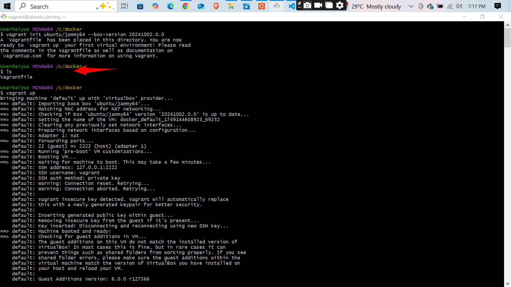
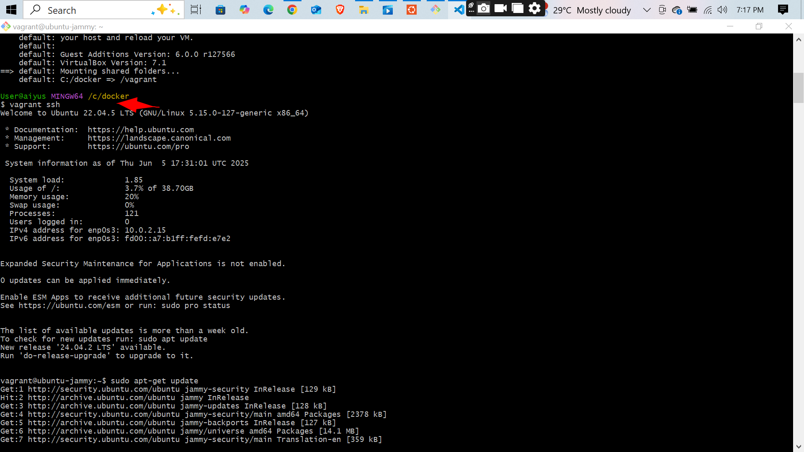
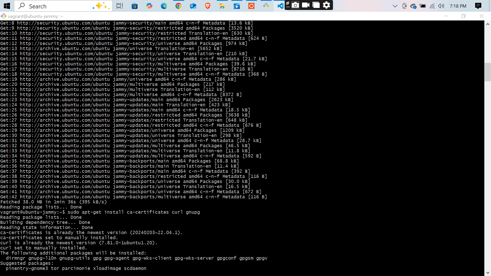
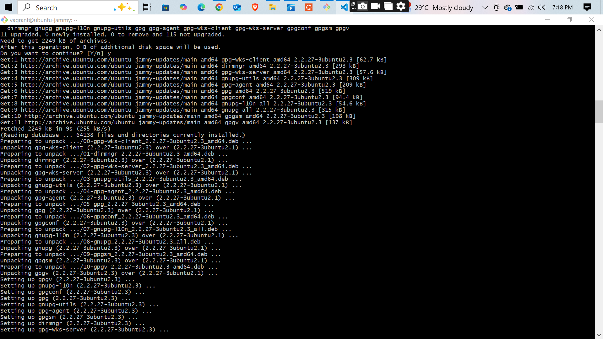
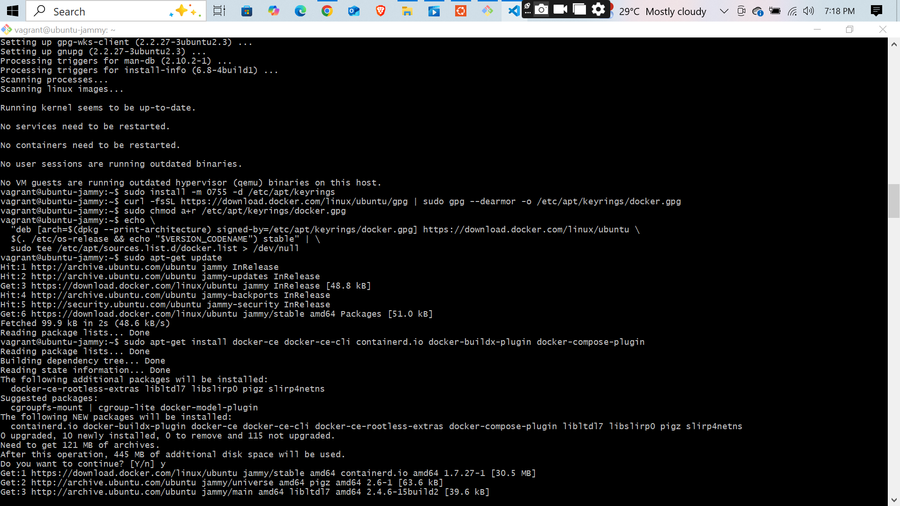
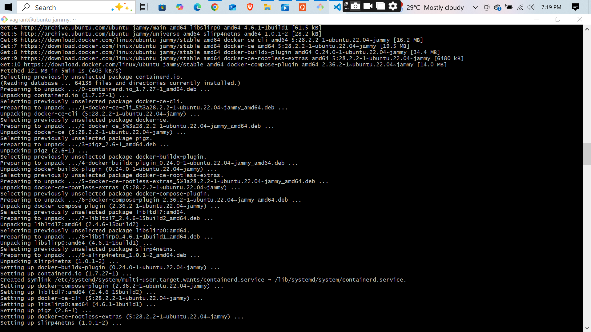
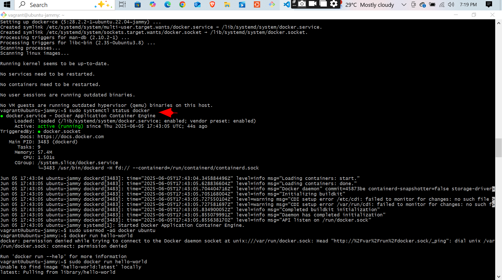
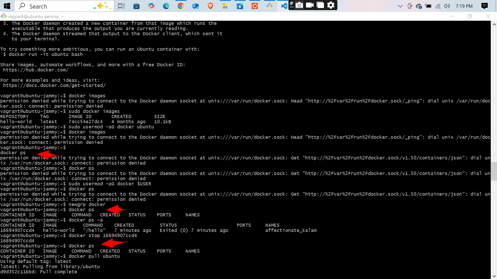
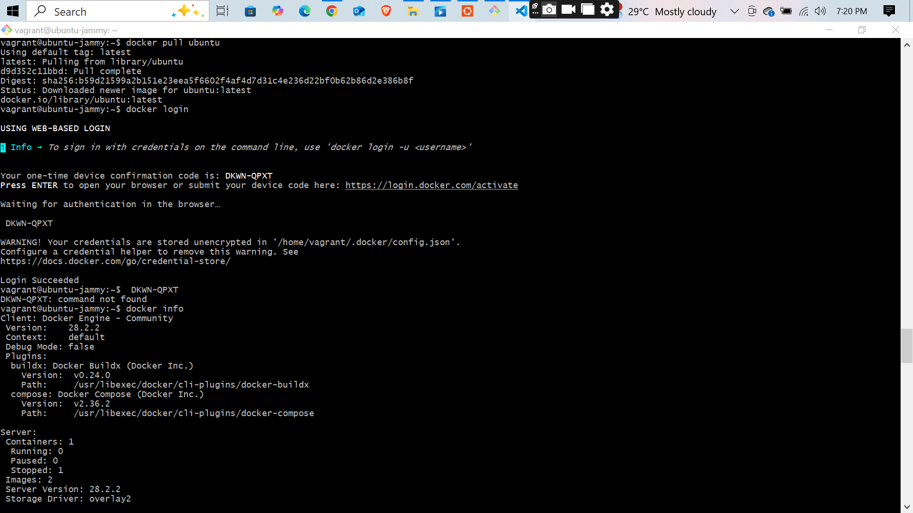
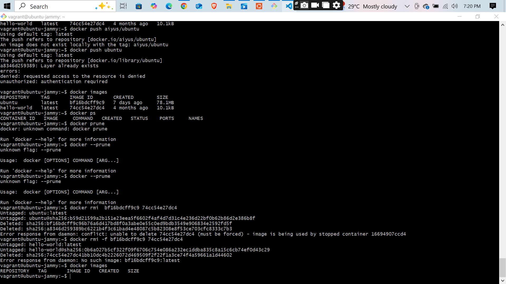

# 🐳 Introduction to Docker and Containers

This project focuses on the **basics of Docker and containerization**, including:

- ✅ Installing Docker
- ✅ Running key Docker commands:
  - `docker run`
  - `docker images`
  - `docker ps`
  - `docker ps -a`
  - `docker push`
  - `docker rmi`
  - `docker stop`

---

## 📸 Screenshots

Each screenshot highlights part of the Docker learning experience:

  
  
  
  
  
  
  
  
  
  

[🔙 Back to Top](./README.md)
