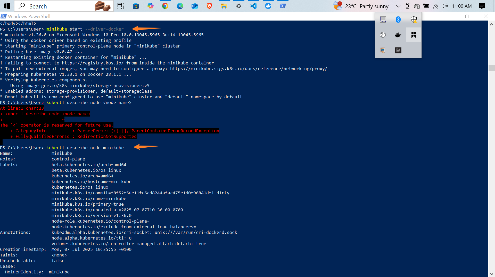
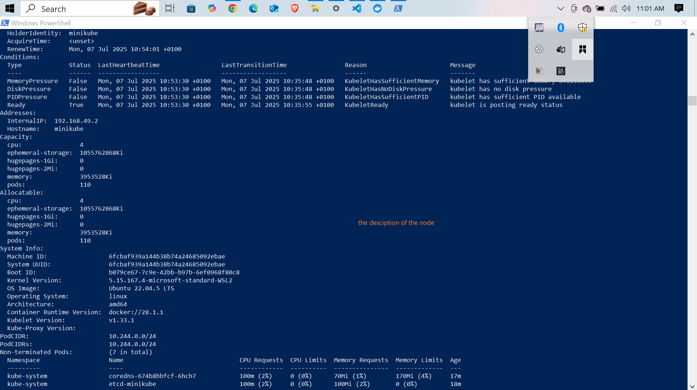
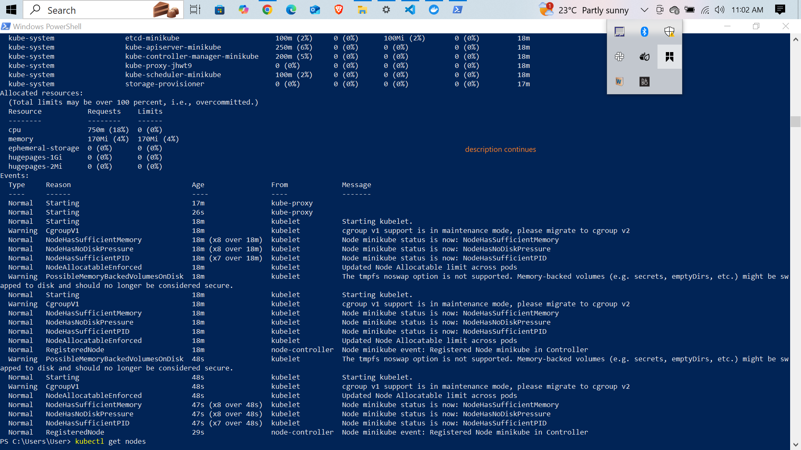
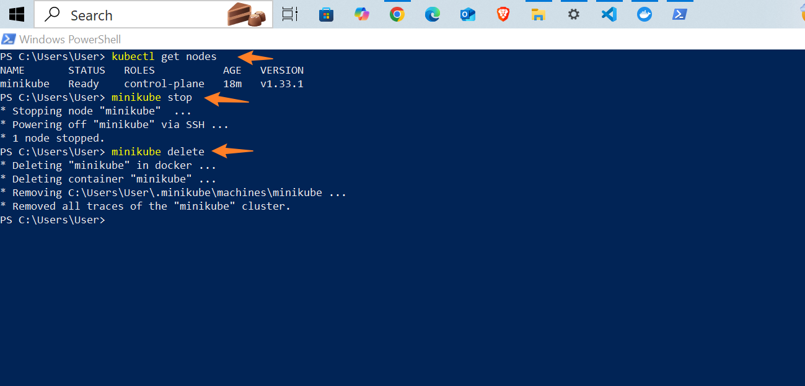

Here's a refined and more professional version of your `README.md` for the Kubernetes/Minikube node project. I've corrected grammar, improved clarity, added structure, and used proper Markdown formatting to make it GitHub-friendly and informative:

---

# ⚙️ Working with Kubernetes Node using Minikube

## 📌 Project Overview

This project demonstrates how to use **Minikube** to create and manage a single-node **Kubernetes cluster** locally. Minikube is an excellent tool for learning and prototyping with Kubernetes on your personal machine.

In this project, we performed key operations such as starting Minikube, inspecting the Kubernetes node, and stopping or deleting the Minikube cluster.

---

## 🧪 Commands Used

```bash
minikube start                     # Starts the Minikube container and initializes the Kubernetes cluster
kubectl get nodes                  # Displays the current node(s) in the Kubernetes cluster
kubectl describe node minikube     # Provides detailed information about the Minikube node
minikube stop                      # Stops the running Minikube cluster
minikube delete                    # Deletes the Minikube cluster and its associated files
```

> ⚠️ Note: `kubectl` is the Kubernetes CLI tool that interacts with Minikube's internal cluster.

---

## 📸 Screenshots

Below are screenshots showing the project in action:

| Command                               | Screenshot                        |
| ------------------------------------- | --------------------------------- |
| `minikube start`                      |  |
| `kubectl get nodes`                   |       |
| `kubectl describe node minikube`      |   |
| `minikube stop` and `minikube delete` |     |

---

## ✅ What This Project Demonstrates

* How to **set up a local Kubernetes cluster** using Minikube.
* How to **inspect and interact** with the Kubernetes node.
* How to **clean up resources** using Minikube commands.
* Provides a foundation for deploying containers, services, and exploring Kubernetes concepts locally.

---
