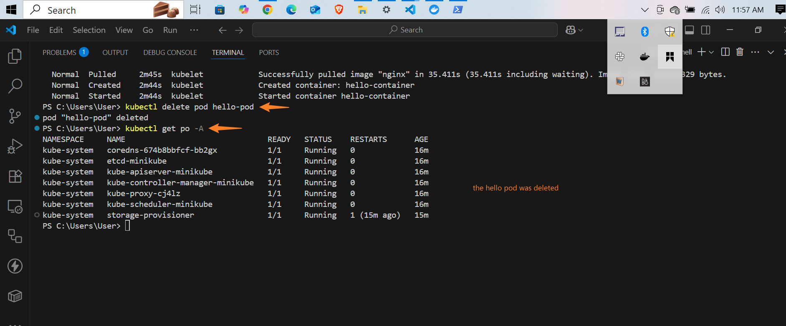

---

# 📦 Working with Kubernetes Pods

## 📝 Project Overview

This project demonstrates how to **create, inspect, and delete a Kubernetes pod** using Minikube. A **pod** is the **smallest deployable unit** in a Kubernetes cluster and typically hosts **one or more tightly coupled containers** that share the same network namespace and storage.

The project also explores the use of the `kubectl` command-line tool to manage pod lifecycle operations.

---

## 🧪 Steps Performed

1. **Created a pod manifest file**

   * Filename: `pod.yaml`
   * Defined a simple pod running an `nginx` container.

2. **Applied the configuration to the cluster**

   ```bash
   kubectl apply -f pod.yaml
   ```

3. **Listed all running pods (across all namespaces)**

   ```bash
   kubectl get po -A
   ```

4. **Described the created pod to view detailed metadata and status**

   ```bash
   kubectl describe pod hello-pod
   ```

5. **Deleted the pod**

   ```bash
   kubectl delete pod hello-pod
   ```

---

## 📷 Screenshots

Below are screenshots showing the pod management process:


  
      
 
    

---

## 💡 What This Project Demonstrates

* Basic use of `kubectl` to manage pods
* How to define a pod using a YAML manifest
* How to inspect pod status and details
* Clean-up practices using `kubectl delete`

---

## 🔁 Next Steps

* Deploy multiple containers in a single pod
* Add environment variables, volume mounts, and probes
* Convert the pod into a deployment for higher availability
* Expose the pod with a Kubernetes Service

---

