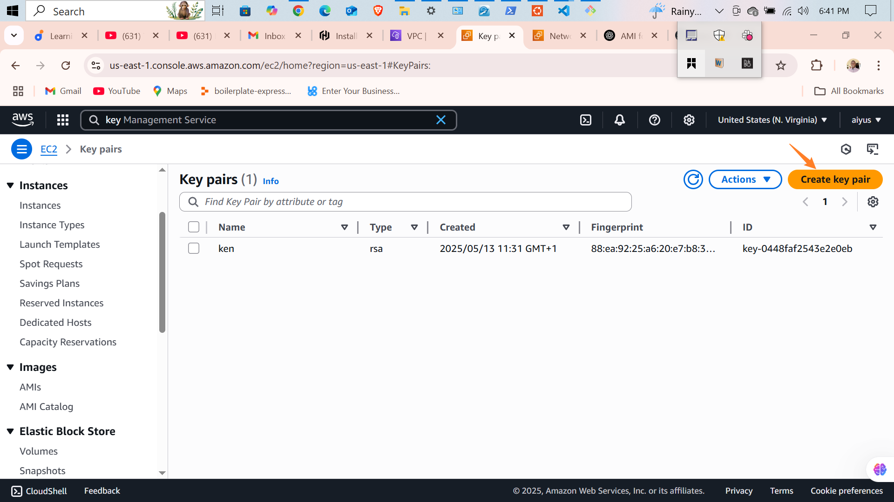
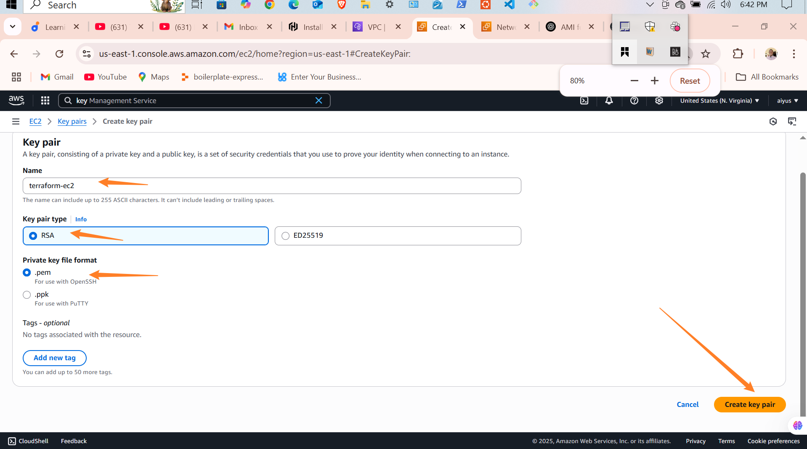
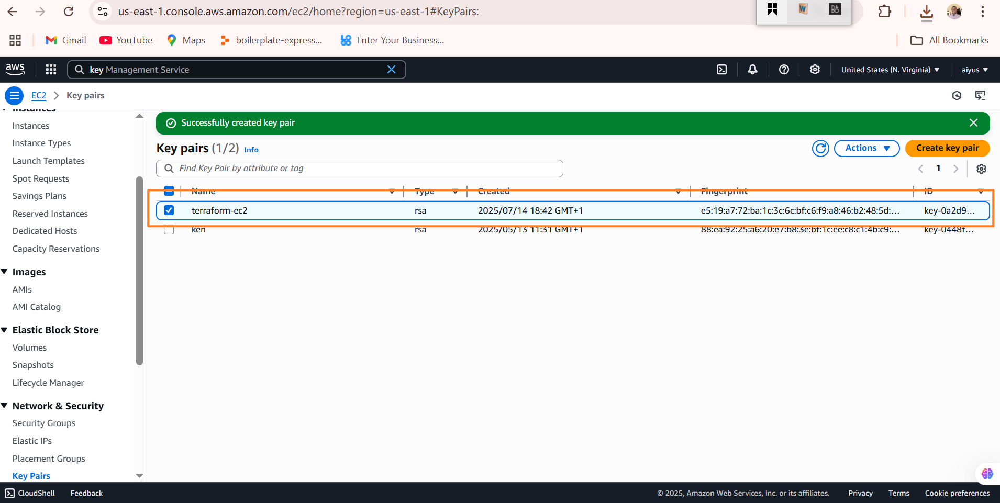
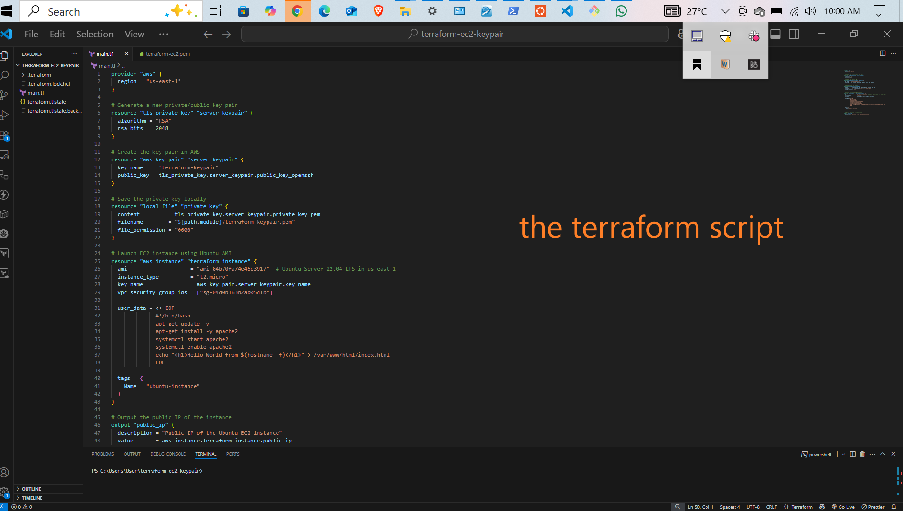
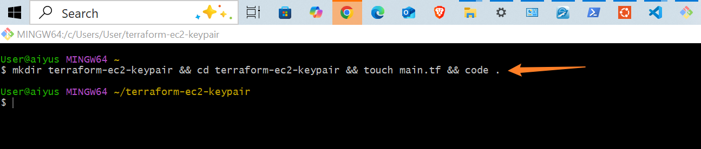
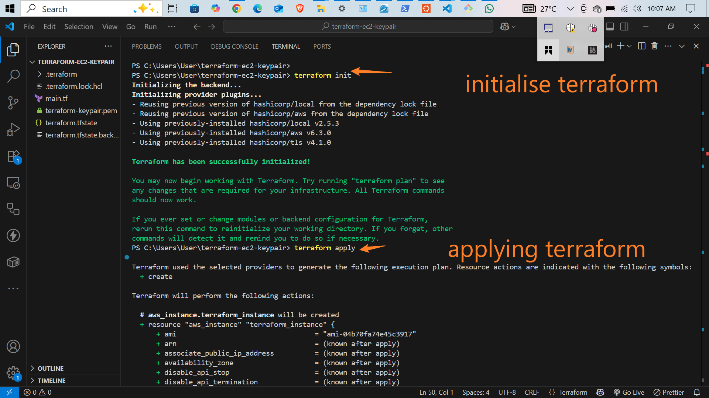
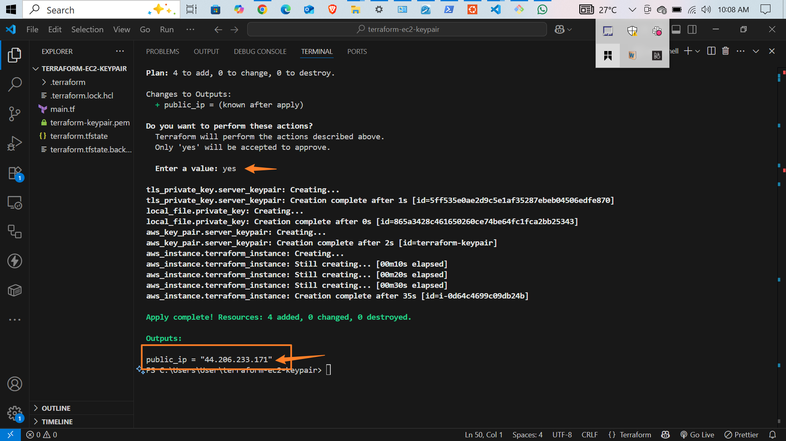

Certainly! Here's an updated version of the README that incorporates your recent screenshots, showing the output after applying and verifying the EC2 instance's public IP and the connection:

---

# Terraform Project Workflow

This README details the step-by-step process I followed to set up, initialize, and verify an AWS EC2 instance using Terraform.

## 1. Accessing AWS Management Console
- Navigated to the **EC2 Key Pairs** section to create a new SSH key pair.
- Created a key pair named `terraform-ec2`, selecting RSA as the key type and `.pem` as the format.
- Downloaded the key file securely.

## 2. Verifying Key Pair Creation
- Confirmed the key pair `terraform-ec2` was successfully created and listed in the AWS console.

## 3. Setting Up the Terraform Configuration
- Created a directory and a new `main.tf` file:

```bash
mkdir terraform-ec2-keypair && cd terraform-ec2-keypair && touch main.tf
```

- Added the following Terraform configuration to provision an EC2 instance with the created key pair:

```h
provider "aws" {
  region = "us-east-1"
}

# Generate a new private/public key pair
resource "tls_private_key" "server_keypair" {
  algorithm = "RSA"
  rsa_bits  = 2048
}

# Create the key pair in AWS
resource "aws_key_pair" "server_keypair" {
  key_name   = "terraform-keypair"
  public_key = tls_private_key.server_keypair.public_key_openssh
}

# Save the private key locally
resource "local_file" "private_key" {
  content         = tls_private_key.server_keypair.private_key_pem
  filename        = "${path.module}/terraform-keypair.pem"
  file_permission = "0600"
}

# Launch EC2 instance using Ubuntu AMI
resource "aws_instance" "terraform_instance" {
  ami                    = "ami-04b70fa74e45c3917"  # Ubuntu Server 22.04 LTS in us-east-1
  instance_type          = "t2.micro"
  key_name               = aws_key_pair.server_keypair.key_name
  vpc_security_group_ids = ["sg-04d0b163b2ad05d1b"]

  user_data = <<-EOF
              #!/bin/bash
              apt-get update -y
              apt-get install -y apache2
              systemctl start apache2
              systemctl enable apache2
              echo "<h1>Hello World from $(hostname -f)</h1>" > /var/www/html/index.html
              EOF

  tags = {
    Name = "ubuntu-instance"
  }
}

# Output the public IP of the instance
output "public_ip" {
  description = "Public IP of the Ubuntu EC2 instance"
  value       = aws_instance.terraform_instance.public_ip
}

```

## 4. Initializing Terraform
- Ran the command:

```bash
terraform init
```

to initialize the backend and prepare the workspace.

## 5. Applying the Terraform Plan
- Executed:

```bash
terraform apply
```

- Confirmed the deployment by typing `yes`.
- Observed the output indicating successful creation of resources and the assignment of a public IP address.

```plaintext
Apply complete! Resources: 4 added, 0 changed, 0 destroyed.
Outputs:
  public_ip = "44.206.233.171"
```

## 6. Verifying the EC2 Instance
- Used the identified public IP `44.206.233.171` to verify connectivity.
- Accessed the instance through a web browser or SSH:
  - Browsing to `http://44.206.233.171/` showed a default webpage or the application hosted.

- The SSH connection can be established as follows:

```bash
chmod 400 /path/to/terraform-ec2.pem
ssh -i /path/to/terraform-ec2.pem ec2-user@44.206.233.171
```

> **Note:** The web browser indicates `Not secure`, which is expected for a default instance.

## 7. Summary
- Successfully set up and deployed an EC2 instance using Terraform.
- The instance's public IP is verified to be `44.206.233.171`, accessible from the browser.
- Terraform managed all resource provisioning efficiently, ensuring reproducibility.

---

## Screen Shots

 
---
 
---
 
---
 
---
 
---
 
---
 
---
