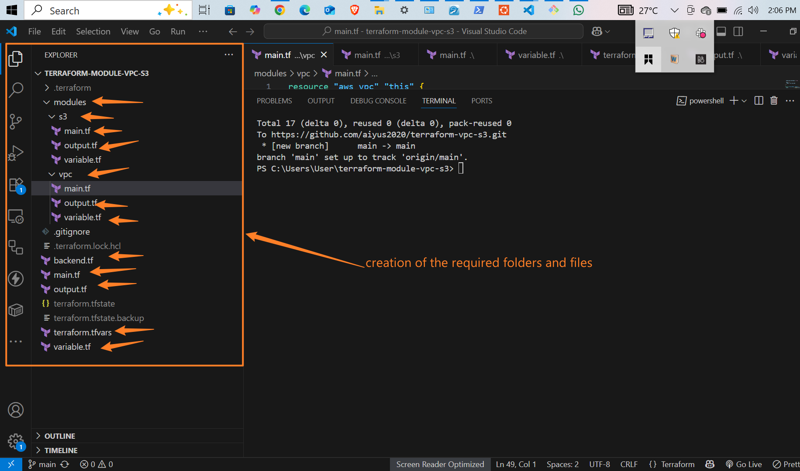
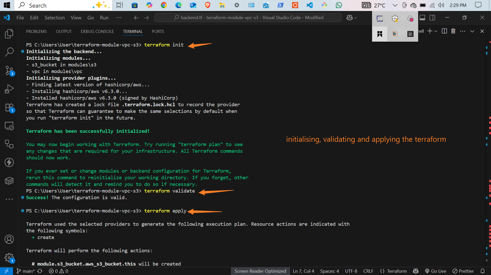
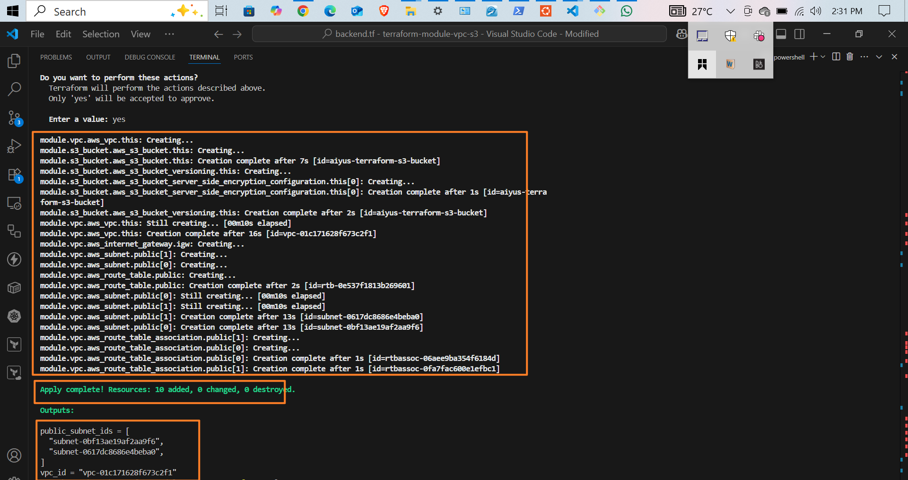
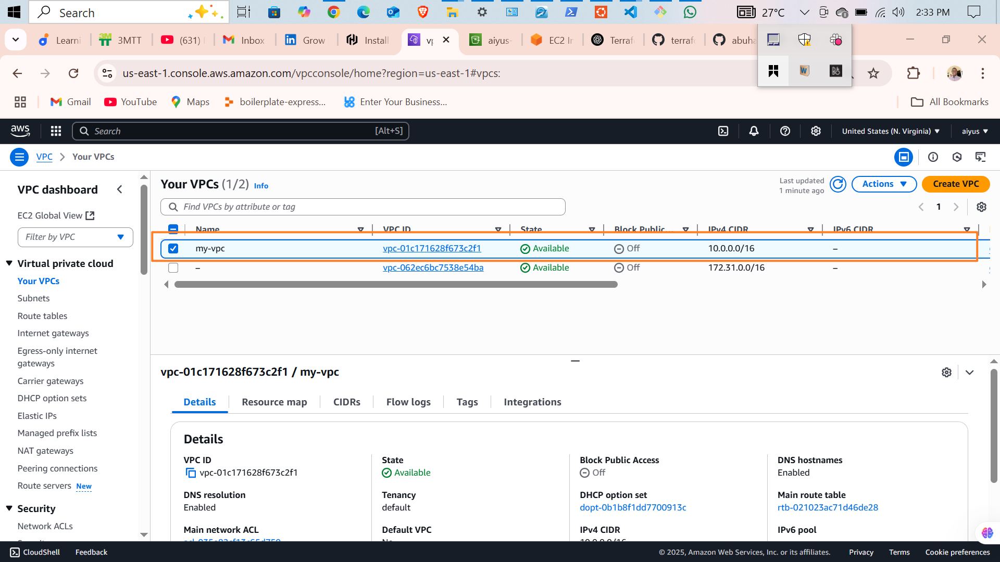
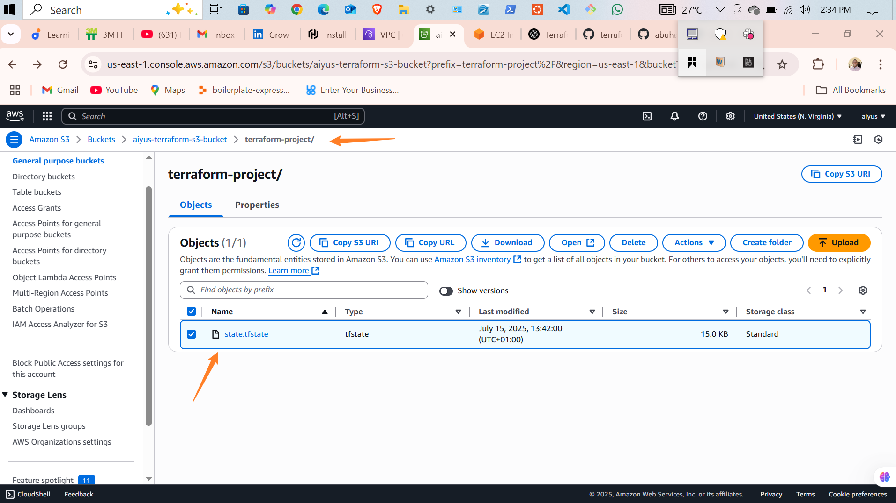
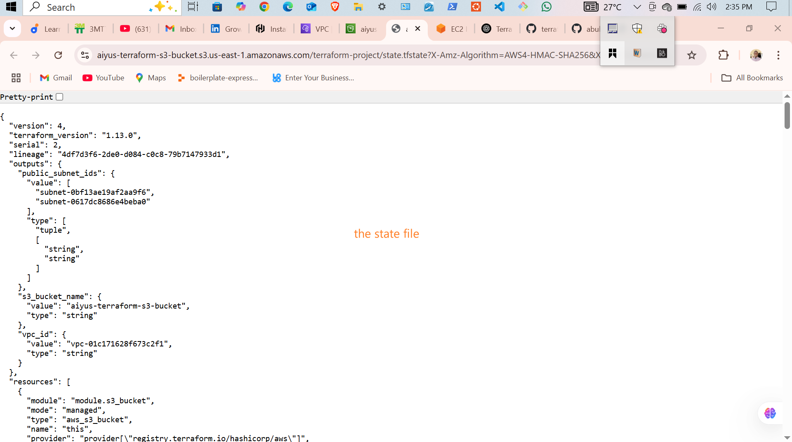
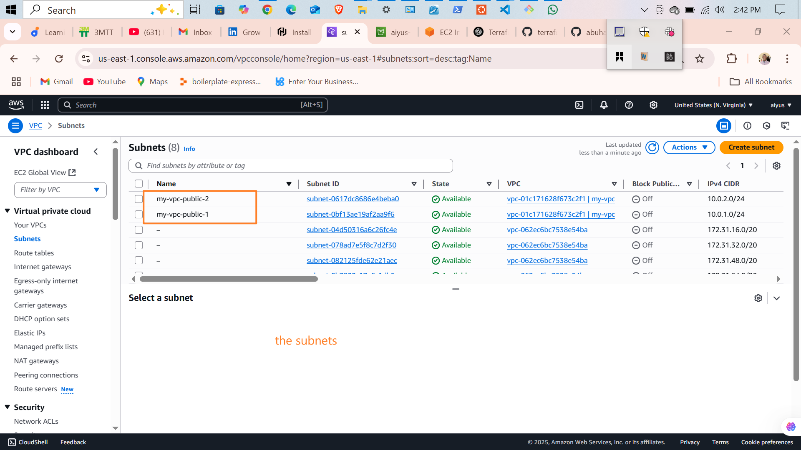
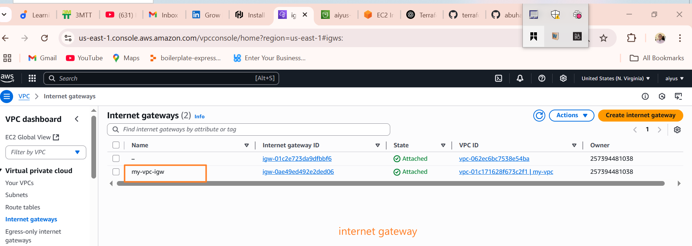

# 🌍 Terraform AWS Infrastructure Project

This is a fully modular Terraform project that automates the deployment of:

- ✅ A custom **VPC** with public subnets
- ✅ A secured **S3 bucket**
- ✅ Remote backend configuration using **S3 + DynamoDB**
- ✅ Modular code organization

---

## 📂 Project Structure

```

terraform-project/
├── main.tf
├── variables.tf
├── terraform.tfvars
├── outputs.tf
├── backend.tf
├── .gitignore
├── README.md
└── modules/
├── vpc/
│   ├── main.tf
│   ├── variables.tf
│   └── outputs.tf
└── s3/
├── main.tf
├── variables.tf
└── outputs.tf

````

---

## 🚀 Usage


4. **Apply the configuration**

   ```bash
   terraform apply
   ```

---

## 🧾 Files and Scripts

### 📄 `main.tf`

```hcl
provider "aws" {
  region = "us-east-1"
}

module "vpc" {
  source         = "./modules/vpc"
  vpc_name       = var.vpc_name
  vpc_cidr       = var.vpc_cidr
  public_subnets = var.public_subnets
  azs            = var.azs
}

module "s3_bucket" {
  source            = "./modules/s3"
  bucket_name       = var.bucket_name
  enable_versioning = var.enable_versioning
  enable_encryption = var.enable_encryption
  force_destroy     = var.force_destroy
}
```

---

### 📄 `variables.tf`

```hcl
# VPC
variable "vpc_name" {
  type = string
}
variable "vpc_cidr" {
  type = string
}
variable "public_subnets" {
  type = list(string)
}
variable "azs" {
  type = list(string)
}

# S3
variable "bucket_name" {
  type = string
}
variable "enable_versioning" {
  type = bool
}
variable "enable_encryption" {
  type = bool
}
variable "force_destroy" {
  type = bool
}
```

---

### 📄 `terraform.tfvars`

```hcl
# VPC values
vpc_name       = "my-vpc"
vpc_cidr       = "10.0.0.0/16"
public_subnets = ["10.0.1.0/24", "10.0.2.0/24"]
azs            = ["us-east-1a", "us-east-1b"]

# S3 values
bucket_name       = "aiyus-terraform-s3-bucket"
enable_versioning = true
enable_encryption = true
force_destroy     = true
```

---

### 📄 `outputs.tf`

```hcl
output "vpc_id" {
  value = module.vpc.vpc_id
}

output "public_subnet_ids" {
  value = module.vpc.public_subnet_ids
}

output "s3_bucket_name" {
  value = module.s3_bucket.bucket_name
}
```

---

### 📄 `backend.tf`

```hcl
terraform {
  backend "s3" {
    bucket         = "aiyus-hardcoded-s3-bucket-001"
    key            = "terraform/state/terraform.tfstate"
    region         = "us-east-1"
    encrypt        = true
    dynamodb_table = "terraform-locks"
  }
}
```

---

## 📦 Module: `modules/vpc`

### 🔹 `main.tf`

```hcl
resource "aws_vpc" "this" {
  cidr_block           = var.vpc_cidr
  enable_dns_support   = true
  enable_dns_hostnames = true

  tags = {
    Name = var.vpc_name
  }
}

resource "aws_subnet" "public" {
  count             = length(var.public_subnets)
  vpc_id            = aws_vpc.this.id
  cidr_block        = var.public_subnets[count.index]
  availability_zone = var.azs[count.index]
  map_public_ip_on_launch = true

  tags = {
    Name = "${var.vpc_name}-public-${count.index + 1}"
  }
}

resource "aws_internet_gateway" "igw" {
  vpc_id = aws_vpc.this.id

  tags = {
    Name = "${var.vpc_name}-igw"
  }
}

resource "aws_route_table" "public" {
  vpc_id = aws_vpc.this.id

  route {
    cidr_block = "0.0.0.0/0"
    gateway_id = aws_internet_gateway.igw.id
  }

  tags = {
    Name = "${var.vpc_name}-rt"
  }
}

resource "aws_route_table_association" "public" {
  count          = length(aws_subnet.public)
  subnet_id      = aws_subnet.public[count.index].id
  route_table_id = aws_route_table.public.id
}
```

### 🔹 `variables.tf`

```hcl
variable "vpc_name" {
  type = string
}
variable "vpc_cidr" {
  type = string
}
variable "public_subnets" {
  type = list(string)
}
variable "azs" {
  type = list(string)
}
```

### 🔹 `outputs.tf`

```hcl
output "vpc_id" {
  value = aws_vpc.this.id
}

output "public_subnet_ids" {
  value = aws_subnet.public[*].id
}
```

---

## 📦 Module: `modules/s3`

### 🔹 `main.tf`

```hcl
resource "aws_s3_bucket" "this" {
  bucket        = var.bucket_name
  force_destroy = var.force_destroy

  tags = {
    Name = var.bucket_name
  }
}

resource "aws_s3_bucket_versioning" "this" {
  bucket = aws_s3_bucket.this.id

  versioning_configuration {
    status = var.enable_versioning ? "Enabled" : "Suspended"
  }
}

resource "aws_s3_bucket_server_side_encryption_configuration" "this" {
  count  = var.enable_encryption ? 1 : 0
  bucket = aws_s3_bucket.this.id

  rule {
    apply_server_side_encryption_by_default {
      sse_algorithm = "AES256"
    }
  }
}
```

### 🔹 `variables.tf`

```hcl
variable "bucket_name" {
  type = string
}
variable "enable_versioning" {
  type = bool
}
variable "enable_encryption" {
  type = bool
}
variable "force_destroy" {
  type = bool
}
```

### 🔹 `outputs.tf`

```hcl
output "bucket_name" {
  value = aws_s3_bucket.this.bucket
}
```

---

## 🧾 .gitignore

```gitignore
.terraform/
*.tfstate
*.tfstate.backup
*.tfvars
*.pem
```

---

## 📸 Screenshots


---

---

---

---

---

---
 
---



